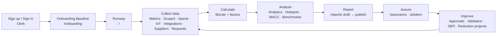
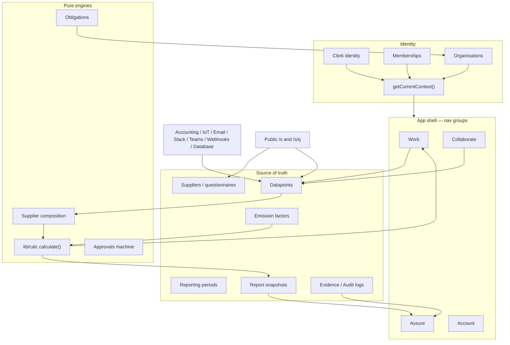
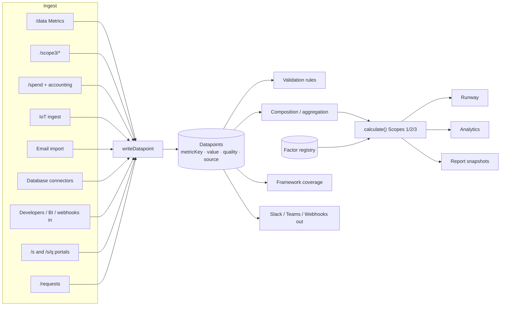
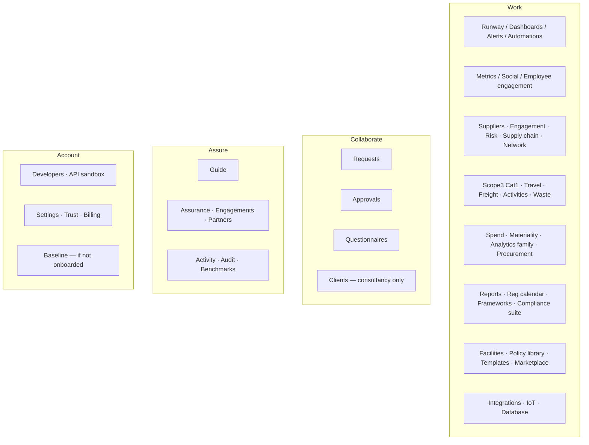
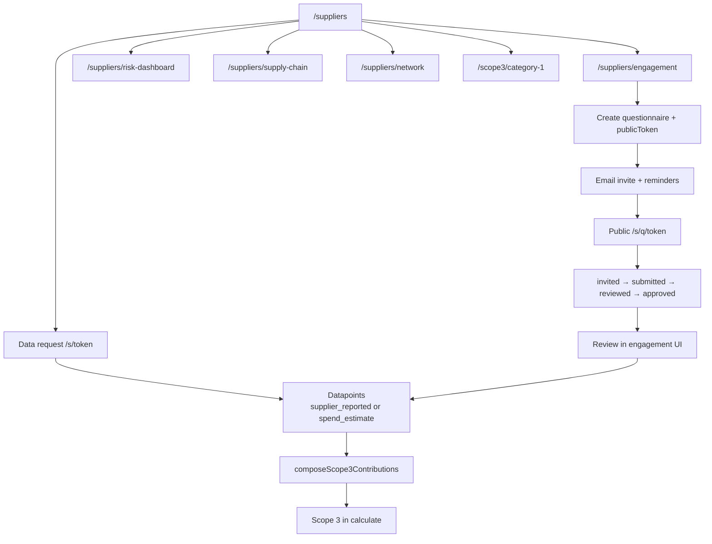
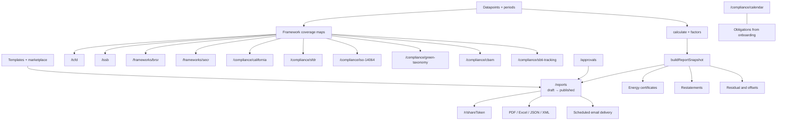
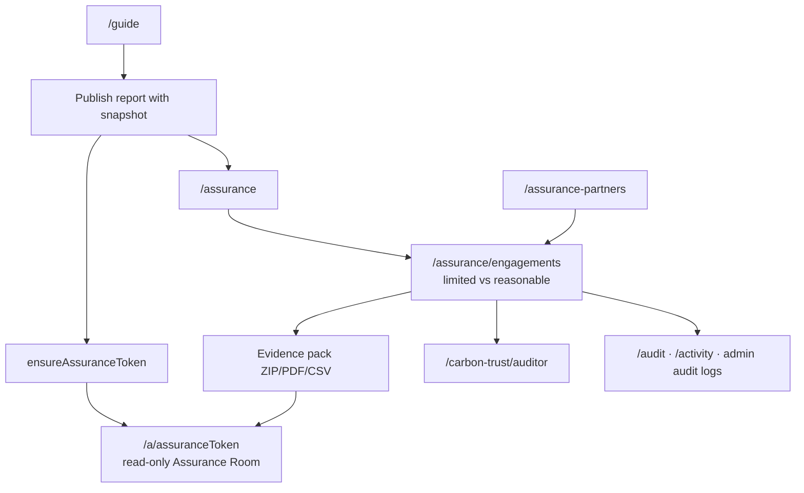
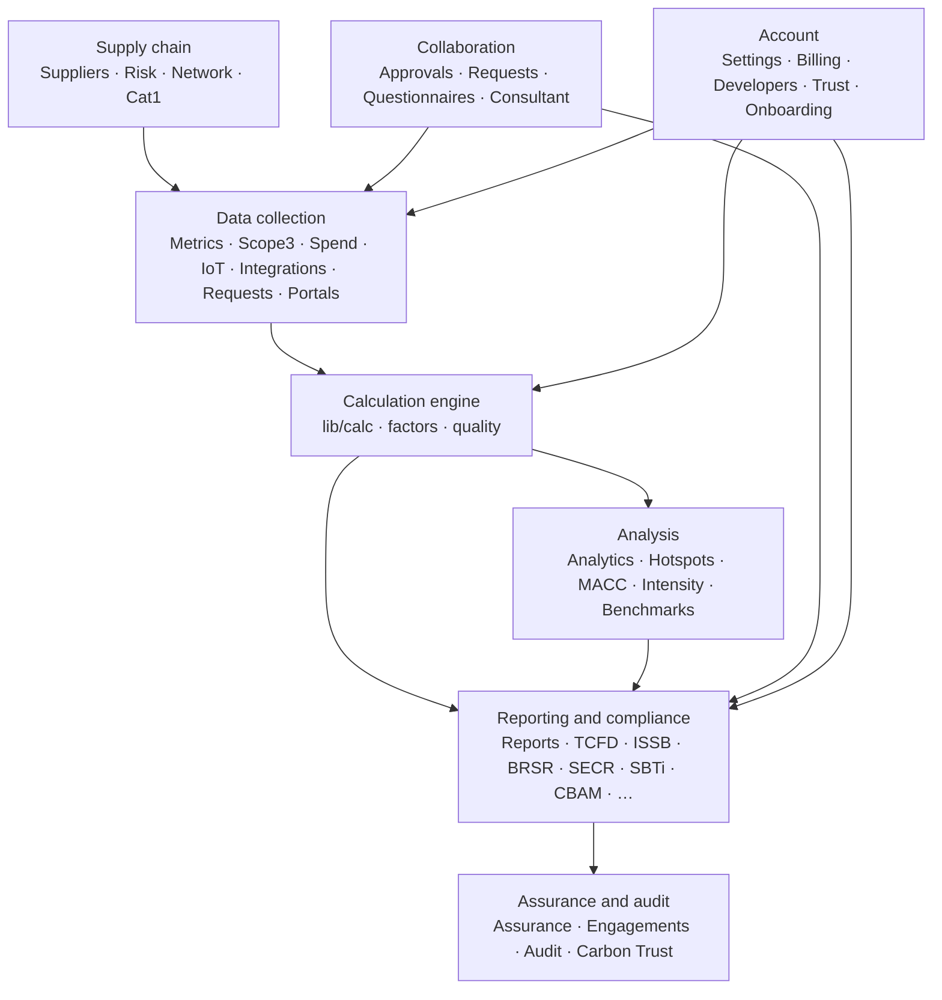
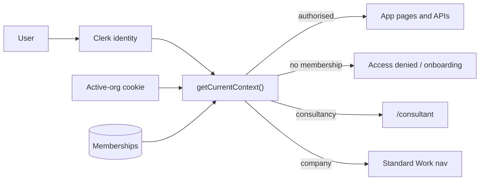

# ClearESG — Complete Platform Functionality Guide

ClearESG is an ESG operating system for measuring, analysing, reporting, and assuring greenhouse-gas and sustainability data. Identity is handled by **Clerk**; authorisation is always resolved server-side through **Payload Membership** via `getCurrentContext()`. Login alone never grants access.

Navigation is organised into four groups: **Work**, **Collaborate**, **Assure**, and **Account**.

This document covers every user-facing page (nav items, settings/billing/admin spokes, and public token routes), in the format:

- **What is the function**
- **What is the use**
- **How the customer will use it**
- **Connected to**

---

## Table of contents

1. [Platform overview](#platform-overview)
2. [Work](#1-work)
3. [Collaborate](#2-collaborate)
4. [Assure](#3-assure)
5. [Account](#4-account)
6. [Settings subpages](#5-settings-subpages)
7. [Billing subpages](#6-billing-subpages)
8. [Admin pages](#7-admin-pages)
9. [Carbon Trust](#8-carbon-trust)
10. [Additional work surfaces](#9-additional-work-surfaces-not-in-main-nav)
11. [Public & auth pages](#10-public--auth-pages)
12. [Diagrams](#11-diagrams)

---

## Platform overview

| Concept               | Meaning                                                                                          |
| --------------------- | ------------------------------------------------------------------------------------------------ |
| **Runway**            | Home command centre — readiness, gauge, gaps, deadlines                                          |
| **Metrics (`/data`)** | Core datapoint workspace for the open reporting period                                           |
| **Datapoints**        | Period-scoped activity values with quality (`measured` / `calculated` / `estimated` / `missing`) |
| **Calc engine**       | Pure `lib/calc` — factors from registry, never silent zeros                                      |
| **Reports**           | Draft → approve → immutable publish (flagship PDF is always light theme)                         |
| **Assurance Room**    | Read-only room on a published frozen snapshot (`/a/[token]`)                                     |
| **Membership**        | Server-side authorisation; org cookie is always revalidated                                      |

**Typical journey:** Sign up → Onboarding (Baseline) → Collect data → Calculate → Analyse → Publish report → Assure → Improve next period.

---

# 1. Work

---

## Page: Runway

**Route:** `/`

**What is the function**  
Home command centre. Shows reporting readiness, the 240° emissions gauge and KPIs, next filing deadline, data gaps, anomalies, and an optional peer/benchmark card. Can stream live KPI updates.

**What is the use**  
Gives the customer a single daily view of “what matters now” for ESG reporting readiness — without opening every module.

**How the customer will use it**

1. Land here after login (redirects to onboarding if not onboarded).
2. Scan gauge / scope totals and quality.
3. Act on gap links (open Metrics, suppliers, or reports).
4. Watch filing deadline from regulatory obligations.
5. Optionally review peer position when opted into benchmarks.

**Connected to**  
Metrics (`/data`), Reports, Onboarding/Guide, Compliance calendar / obligations, Benchmarks, Analytics intensity, Org hierarchy consolidation toggle.

---

## Page: Dashboards

**Route:** `/dashboards`

**What is the function**  
Custom dashboard builder: compose metric, chart, table, and list widgets into role-specific layouts.

**What is the use**  
Different roles (ops, admin, executive) need different views; this avoids forcing one home layout on everyone.

**How the customer will use it**

1. Open Dashboard builder.
2. Create or edit a layout for a role.
3. Add widgets bound to metrics / series.
4. Save and set a role default.
5. Revisit as the living ops wall.

**Connected to**  
Metrics, Analytics, Custom metrics (Settings), Alerts.

---

## Page: Alerts

**Route:** `/alerts`

**What is the function**  
Alert threshold rules: absolute threshold, consecutive breaches, percent change, or cross-metric conditions. Delivers in-app and optionally email / Slack / Teams via automations.

**What is the use**  
Catch emissions or metric breaches early — before they become a published-period problem.

**How the customer will use it**

1. Create a rule against a metric key.
2. Choose condition type and threshold.
3. Enable notification channels.
4. Review firings when metrics update.

**Connected to**  
Automations, Slack, Teams, Notifications, Metrics, Executive dashboard.

---

## Page: Automations

**Route:** `/automations`

**What is the function**  
No-code if-then rules: triggers (approve, alert fire, schedule) → actions (notify, email, Slack, webhook).

**What is the use**  
Reduce manual follow-up for recurring ESG ops (reminders, escalations, external sync).

**How the customer will use it**

1. Create an automation with trigger + action.
2. Link to Slack/webhook if needed.
3. Review recent runs for success/failure.

**Connected to**  
Alerts, Approvals, Slack, Teams, Webhooks, Activity feed.

---

## Page: Metrics (Data workspace)

**Route:** `/data` (nav label: **Metrics**)

**What is the function**  
Primary datapoint entry/edit workspace for the open reporting period: values, quality flags, evidence, and submission into approval chains.

**What is the use**  
This is the system of record for inventory inputs. Nearly every disclosure and calc path depends on datapoints entered here (or written here by integrations).

**How the customer will use it**

1. Select the open period.
2. Fill required metrics (energy, fuels, social, etc.).
3. Attach evidence where needed.
4. Submit for approval.
5. Fix rejected rows and resubmit.
6. Optionally run historical backfill via `/data/backfill`.

**Connected to**  
Approvals, Reports, all framework coverage pages, Scope 3 activity UIs, Spend, IoT, Email import, Requests, Validation rules, Factors, Custom metrics, Social metrics.

---

## Page: Social metrics

**Route:** `/social`

**What is the function**  
Workforce / health & safety / training / pay coverage view mapped to social metric keys.

**What is the use**  
Shows social disclosure readiness (e.g. BRSR / SFDR / CSRD social) separate from carbon inventory.

**How the customer will use it**

1. Review section coverage (honest / weak / missing).
2. Follow gap links into Metrics to fill values.
3. Re-check coverage before publishing frameworks.

**Connected to**  
Metrics (`/data`), BRSR, SFDR PAI, Frameworks hub, Reports.

---

## Page: Employee engagement

**Route:** `/engagement`

**What is the function**  
Lightweight climate-action campaigns with participant or tCO₂e goals; optional commute challenges.

**What is the use**  
Internal engagement and awareness — not an HRIS. Optional link into Scope 3 Category 7 (commuting).

**How the customer will use it**

1. Create a campaign with a goal.
2. Track participation / estimated impact.
3. Optionally link commute challenge to Travel & commute metrics.

**Connected to**  
Travel & commute (`/scope3/travel`), Metrics.

---

## Page: Suppliers

**Route:** `/suppliers`

**What is the function**  
Supplier register and Scope 3 collection hub: create suppliers, send tokenised public forms (`/s/[token]`), track responses.

**What is the use**  
Collect primary Scope 3 data from suppliers who do not need ClearESG accounts.

**How the customer will use it**

1. Add suppliers (or bulk-import).
2. Create data requests and email token links.
3. Review submitted values into datapoints.
4. Jump to engagement, risk, network, or tiers as needed.

**Connected to**  
Engagement, Risk dashboard, Supply chain, Carbon network, Cat 1 tiers, Bulk import, Email import, Settings (supplier portal branding), Public `/s/[token]`.

---

## Page: Engagement (supplier ESG questionnaires)

**Route:** `/suppliers/engagement`

**What is the function**  
Full ESG questionnaire workflows: Invited → In progress → Submitted → Reviewed → Approved, with reminders.

**What is the use**  
Deeper supplier ESG due diligence than a single emissions form.

**How the customer will use it**

1. Create / select a questionnaire template.
2. Invite suppliers (public `/s/q/[token]`).
3. Send reminders (e.g. day 7 / 14).
4. Review and approve submissions.

**Connected to**  
Suppliers, Questionnaires (buyer side), Template marketplace, Email import, Public `/s/q/[token]`.

---

## Page: Supplier risk

**Route:** `/suppliers/risk-dashboard`

**What is the function**  
ESG risk scoring dashboard (Environment / Social / Governance weighted; higher = worse risk).

**What is the use**  
Prioritise which suppliers need engagement, audits, or mitigation.

**How the customer will use it**

1. Filter and sort by risk score.
2. Open a supplier’s risk breakdown.
3. Plan engagement or mitigation for high-risk names.

**Connected to**  
`/suppliers/[id]/risk-breakdown`, Engagement, Compliance dashboard.

---

## Page: Supply chain

**Route:** `/suppliers/supply-chain`

**What is the function**  
Visual radial map of Tier 1–3 suppliers (colour by scope, size by emissions/spend).

**What is the use**  
See chain structure and concentration at a glance.

**How the customer will use it**

1. Open the map for the period.
2. Explore tiers.
3. Drill into supplier tier emissions.

**Connected to**  
Supplier tiers, Cat 1 tiers, `/suppliers/[id]/tier-emissions`.

---

## Page: Carbon network

**Route:** `/suppliers/network`

**What is the function**  
Consent-based Scope 1/2/(3) sharing between ClearESG organisations — peer totals without a rating agency.

**What is the use**  
Replace estimated supplier emissions with shared primary snapshots when both parties consent.

**How the customer will use it**

1. Invite a peer org.
2. Accept and share a snapshot.
3. Use shared totals in Scope 3 composition where applicable.

**Connected to**  
Suppliers, Scope 3 composition / Cat 1.

---

## Page: Cat 1 tiers

**Route:** `/scope3/category-1`

**What is the function**  
Category 1 (purchased goods & services) roll-up across Tier 1+2+3 — actual vs estimated.

**What is the use**  
See purchased-goods hotspots and data quality by supplier tier.

**How the customer will use it**

1. Select period.
2. Review roll-up and per-supplier contribution.
3. Improve primary data via supplier portal or spend estimates.

**Connected to**  
Suppliers, Spend, Tier emissions, Supply chain map, Metrics.

---

## Page: Travel & commute

**Route:** `/scope3/travel`

**What is the function**  
Scope 3 Category 6 (business travel) mode-split and Category 7 (employee commuting) entry → datapoints.

**What is the use**  
Structured activity data for travel and commute instead of opaque totals.

**How the customer will use it**

1. Enter travel by mode (or legacy aggregate).
2. Enter commute data.
3. Values write into Metrics / calc as Scope 3.

**Connected to**  
Metrics, Employee engagement, Factors registry.

---

## Page: Freight & logistics

**Route:** `/scope3/freight`

**What is the function**  
Scope 3 Category 4 / 9 freight entry as tonne-km by mode, factored via the registry.

**What is the use**  
Logistics emissions from activity data rather than pure spend.

**How the customer will use it**

1. Enter tonne-km by transport mode.
2. Review calculated kg/tCO₂e.
3. Confirm datapoints in Metrics.

**Connected to**  
Metrics, Factors, Scope 3 overview.

---

## Page: Scope 3 activities

**Route:** `/scope3/data`

**What is the function**  
Generic Scope 3 activity record list (filter, edit, delete) backed by CSV/source imports.

**What is the use**  
Manage activity rows that are not covered by travel/freight specialised UIs.

**How the customer will use it**

1. Filter by period/category/source.
2. Edit or delete rows.
3. Import via `/scope3/import` when scaling.

**Connected to**  
`/scope3/import`, `/scope3/sources`, `/scope3` overview, Metrics.

---

## Page: Waste & water

**Route:** `/operations/waste-water`

**What is the function**  
Operational water and waste metrics (E3/E5-style), with optional Scope 3 Category 5 link for waste.

**What is the use**  
Ops environmental disclosure beyond GHG-only inventory.

**How the customer will use it**

1. Enter waste and water volumes for sites/period.
2. Link to IoT water meters when available.
3. Review resulting datapoints / Category 5.

**Connected to**  
Metrics, Facilities, IoT, Scope 3.

---

## Page: Spend

**Route:** `/spend`

**What is the function**  
Spend-based Scope 3: map GL / chart-of-accounts spend → IO emission factors → kg CO₂e preview. Primary supplier data supersedes spend for the same supplier.

**What is the use**  
Estimate Scope 3 quickly from finance data when activity data is incomplete.

**How the customer will use it**

1. Connect Accounting or upload spend mapping.
2. Map accounts to factors.
3. Preview emissions; write estimates into inventory.
4. Replace estimates with supplier primary over time.

**Connected to**  
Accounting integration, Database connectors, Cat 1, Suppliers composition, Factors.

---

## Page: Materiality

**Route:** `/materiality`

**What is the function**  
Double-materiality workshop: score topics on impact / financial axes; matrix is the output of scores.

**What is the use**  
CSRD-style materiality to decide which topics to disclose and prioritise.

**How the customer will use it**

1. Score topics on both axes.
2. Review matrix and thresholds.
3. Use results to focus Metrics / framework work.

**Connected to**  
Frameworks, Reports, Billing (feature gating may apply).

---

## Page: Analytics

**Route:** `/analytics`

**What is the function**  
Analytics & Insights hub with tabs for benchmarks, scenarios, pathways, forecasts, and intensity views.

**What is the use**  
Planning and what-if analysis on top of the same calc baseline as Runway/reports.

**How the customer will use it**

1. Open Analytics and switch tabs.
2. Explore scenarios / pathways / forecasts.
3. Drill to dedicated tools (compare, MACC, hotspots, etc.).

**Connected to**  
Compare, MACC, Target cascade, Reduction projects, Hotspots, Product footprints, Intensity, Root cause, Executive dashboard, Benchmarks, SBTi.

---

## Page: Compare

**Route:** `/analytics/compare`

**What is the function**  
Comparison tools: year-over-year, department / supplier / metric splits, multi-period views.

**What is the use**  
Explain change — what moved, where, and by how much.

**How the customer will use it**

1. Pick periods and dimensions.
2. Compare series.
3. Export findings; follow into hotspots / root-cause.

**Connected to**  
Hotspots, Root cause, Analytics hub.

---

## Page: MACC / abatement

**Route:** `/analytics/macc`

**What is the function**  
Marginal Abatement Cost Curve from user-entered levers (CAPEX, OPEX, abatement tCO₂e).

**What is the use**  
Prioritise reduction investments by cost per tonne.

**How the customer will use it**

1. Enter abatement levers.
2. View curve ranking.
3. Create reduction projects from preferred levers.

**Connected to**  
Reduction projects, SBTi, Target cascade, Analytics scenarios.

---

## Page: Target cascade

**Route:** `/analytics/target-cascade`

**What is the function**  
Allocate an organisation target down to facilities (share % or absolute tonnes) and roll up progress.

**What is the use**  
Make science-based / board targets actionable at site level.

**How the customer will use it**

1. Create a cascade from an org target.
2. Allocate to facilities.
3. Track roll-up vs actuals.

**Connected to**  
Facilities, SBTi, Reduction projects, Metrics.

---

## Page: Reduction projects

**Route:** `/analytics/reduction-projects`

**What is the function**  
Track mitigation projects with planned vs measured tCO₂e (actuals stay blank until known — never invent zero).

**What is the use**  
Delivery tracking for the reduction plan that MACC / targets imply.

**How the customer will use it**

1. Add project (owner, status, planned reduction).
2. Optionally link facility / metric.
3. Record measured actuals when available.

**Connected to**  
MACC, Facilities, Residual & offsets, SBTi.

---

## Page: Hotspots

**Route:** `/analytics/hotspots`

**What is the function**  
Rank facilities, suppliers, categories, or metric keys by emissions share.

**What is the use**  
Find where action has the largest impact.

**How the customer will use it**

1. Select period and dimension.
2. Rank hotspots.
3. Drill to facilities, compare, or root-cause.

**Connected to**  
Compare, Root cause, Facilities, Suppliers, Cat 1.

---

## Page: Product footprints

**Route:** `/analytics/product-footprints`

**What is the function**  
SKU-level cradle-to-grave footprints from user-entered activity and factors (no paid LCA database).

**What is the use**  
Product-level carbon for customers, labels, or design choices.

**How the customer will use it**

1. Add product + SKU + period.
2. Enter activity lines.
3. Calculate tCO₂e; empty lines stay `missing`.

**Connected to**  
Factors, Analytics, Procurement trade-offs.

---

## Page: Procurement trade-offs

**Route:** `/procurement/tradeoffs`

**What is the function**  
Rank purchase options on cost vs carbon (± lead time) with weighted / Pareto views.

**What is the use**  
Support greener procurement decisions with explicit trade-offs.

**How the customer will use it**

1. Enter options (cost, carbon, lead time).
2. Set weights.
3. Review ranking / Pareto frontier.

**Connected to**  
Spend, Suppliers, Product footprints.

---

## Page: Reports

**Route:** `/reports`

**What is the function**  
Flagship publish flow: build report snapshot (calc + factors + gaps) → draft → approve → immutable publish. Exports (PDF always light theme, Excel, JSON/XML), board/investor pack, share tokens, scheduling.

**What is the use**  
Produce the living sustainability report artefact for boards, regulators, and public share links.

**How the customer will use it**

1. Generate draft from current period inventory.
2. Review gaps and coverage.
3. Run approval chain.
4. Publish (locks snapshot).
5. Share `/r/[token]`, open Assurance Room `/a/[token]`, export packs, schedule email delivery.

**Connected to**  
Metrics, Approvals, Assurance, Assurance partners, Frameworks, Billing, Public report/HTML/embed routes, Unsubscribe.

---

## Page: Reg calendar

**Route:** `/compliance/calendar`

**What is the function**  
Organisation-applicable regulatory deadlines (CSRD, ISSB, SBTi, etc.) derived from onboarding profile / obligations.

**What is the use**  
Never miss a filing window; surface urgency on Runway.

**How the customer will use it**

1. View upcoming deadlines.
2. Focus on items due within ~30 days.
3. Export checklist; push work to Jira/Linear if connected.

**Connected to**  
Onboarding obligations, Runway, Work trackers, Framework pages.

---

## Page: TCFD

**Route:** `/tcfd`

**What is the function**  
Four-pillar TCFD climate disclosure wizard (Governance, Strategy, Risk, Metrics & Targets).

**What is the use**  
Produce TCFD-aligned disclosure without starting from a blank document.

**How the customer will use it**

1. Complete pillars with linked metrics/scenarios.
2. Move draft → final.
3. Export PDF (light theme).

**Connected to**  
ISSB (can inherit), Analytics scenarios, Reports, Metrics.

---

## Page: ISSB

**Route:** `/issb`

**What is the function**  
ISSB S1 + S2 disclosure flow; can inherit from a completed TCFD pack.

**What is the use**  
International sustainability disclosure aligned to ISSB.

**How the customer will use it**

1. Optionally link TCFD.
2. Complete S1/S2 sections.
3. Finalise and export PDF.

**Connected to**  
TCFD, Reports, Metrics, Analytics.

---

## Page: BRSR

**Route:** `/frameworks/brsr`

**What is the function**  
India BRSR Core / Comprehensive principle coverage against mapped metrics.

**What is the use**  
BRSR readiness for Indian listed / large companies.

**How the customer will use it**

1. Review principle coverage grades.
2. Fill gaps in Metrics / Social.
3. Publish or export via Reports / framework reports.

**Connected to**  
Social metrics, Metrics, Frameworks hub, Reports.

---

## Page: SECR

**Route:** `/frameworks/secr`

**What is the function**  
UK SECR disclosure pack coverage for energy and carbon sections.

**What is the use**  
Prepare UK Streamlined Energy and Carbon Reporting.

**How the customer will use it**

1. Review SECR section gaps.
2. Fill Metrics / certificates.
3. Export / publish pack.

**Connected to**  
Metrics, Energy certificates, Reports.

---

## Page: SBTi

**Route:** `/compliance/sbti-tracking`

**What is the function**  
Science Based Targets Initiative tracking: baseline, target, current progress.

**What is the use**  
Prove whether the organisation is on track vs science-based targets.

**How the customer will use it**

1. Create / configure target.
2. Link baseline period and current inventory.
3. Track progress; cascade to facilities; model pathways in Analytics.

**Connected to**  
Target cascade, MACC, Analytics scenarios, Reduction projects, Reg calendar.

---

## Page: ISO 14064

**Route:** `/compliance/iso-14064`

**What is the function**  
ISO 14064-1/2 certification checklist with evidence links and verifier assignment.

**What is the use**  
Prepare for ISO GHG verification / certification.

**How the customer will use it**

1. Work through checklist items.
2. Attach evidence.
3. Assign verifier; hand off to assurance / Carbon Trust flows.

**Connected to**  
Assurance, Carbon Trust auditor, Evidence packs, Audit log.

---

## Page: Green Taxonomy

**Route:** `/compliance/green-taxonomy`

**What is the function**  
EU Green Taxonomy assessment: substantial contribution + DNSH across six environmental objectives.

**What is the use**  
Disclose taxonomy-aligned turnover / CapEx / OpEx style activity alignment.

**How the customer will use it**

1. Assess economic activities.
2. Mark N/A objectives where appropriate.
3. Review alignment summary (also via `/frameworks/taxonomy`).

**Connected to**  
`/frameworks/taxonomy`, Reports, Metrics.

---

## Page: CBAM

**Route:** `/compliance/cbam`

**What is the function**  
EU CBAM importer register: goods (CN codes), quantities, embedded emissions, quarterly liability estimate.

**What is the use**  
Support CBAM reporting for importers of covered goods.

**How the customer will use it**

1. Enter goods / quarter.
2. Record embedded emissions.
3. Review estimated liability.

**Connected to**  
Spend, Suppliers, Metrics.

---

## Page: Energy certificates

**Route:** `/compliance/certificates`

**What is the function**  
Register REC / GO / EAC / PPA / green tariffs for market-based Scope 2 claims.

**What is the use**  
Document green power instruments separately from residual offsets.

**How the customer will use it**

1. Enter certificate lots against electricity consumption.
2. Compare coverage vs `electricity_kwh`.
3. See market-based Scope 2 impact on Runway / reports.

**Connected to**  
Runway Scope 2, Residual & offsets (separate), SECR, Calc engine.

---

## Page: Base-year restatements

**Route:** `/compliance/ghg/restatements`

**What is the function**  
GHG Protocol structural-change / base-year restatement notes with comparison.

**What is the use**  
Honest disclosure when organisational boundaries or methodology change.

**How the customer will use it**

1. Record the structural change.
2. Compare affected years.
3. Finalise restatement note for reports / auditors.

**Connected to**  
Reports, Audit, Org hierarchy.

---

## Page: Residual & offsets

**Route:** `/compliance/residual`

**What is the function**  
Residual emissions ledger: inventory − reductions − retired credits. Offsets are never confused with energy certificates.

**What is the use**  
Tell a clear net residual / offset story without silently zeroing missing inventory.

**How the customer will use it**

1. Review inventory residual.
2. Enter retired credit lots.
3. Link reduction projects where relevant.

**Connected to**  
Energy certificates (distinct), Reduction projects, Reports, Calc quality rules.

---

## Page: Facilities

**Route:** `/facilities`

**What is the function**  
Operational sites and meters (campus / building hierarchy — not legal consolidation).

**What is the use**  
Site-level tracking, IoT assignment, and target cascade allocation.

**How the customer will use it**

1. Add offices, plants, warehouses.
2. Attach meters.
3. Link IoT devices; use sites in cascade / hotspots.

**Connected to**  
Org hierarchy (legal vs ops), IoT devices/gateways, Target cascade, Hotspots, Waste & water.

---

## Page: Policy library

**Route:** `/policies`

**What is the function**  
Register climate / travel / supplier policies with version, owner, effective date, status, document URL.

**What is the use**  
Policy evidence for auditors and frameworks — not the ABAC access-control system.

**How the customer will use it**

1. Add policy documents.
2. Track versions and owners.
3. Link from assurance evidence.

**Connected to**  
Assurance engagements, ISO checklist.  
_(Different from Settings → Policy Management ABAC.)_

---

## Page: California SB 253/261

**Route:** `/compliance/california`

**What is the function**  
California climate disclosure checklists for SB 253 and SB 261.

**What is the use**  
Prepare for California climate reporting obligations.

**How the customer will use it**

1. Work through checklist.
2. Fill Metrics / Scope 3 gaps.
3. Track readiness vs deadlines.

**Connected to**  
Metrics, Scope 3, Reg calendar, Reports.

---

## Page: SFDR PAI

**Route:** `/compliance/sfdr`

**What is the function**  
SFDR Principal Adverse Impact indicator coverage.

**What is the use**  
Support fund / financial-market-participant PAI reporting.

**How the customer will use it**

1. Review PAI sections.
2. Fill social / environmental metric gaps.
3. Export / disclose via reports.

**Connected to**  
Metrics, Social metrics, Reports.

---

## Page: Templates

**Route:** `/compliance-templates`

**What is the function**  
Industry starter and custom compliance questionnaire / assessment templates with PDF output.

**What is the use**  
Bootstrap compliance packs without building from scratch.

**How the customer will use it**

1. Pick or create a template.
2. Run an assessment.
3. Export PDF; pull packs from marketplace.

**Connected to**  
Template marketplace, Questionnaires, Supplier engagement.

---

## Page: Template marketplace

**Route:** `/templates/marketplace`

**What is the function**  
Browse free industry packs (questionnaires, report layouts, metric sets) and apply into the organisation.

**What is the use**  
Fast onboarding of sector-appropriate structures.

**How the customer will use it**

1. Filter by industry / kind.
2. Apply pack to org.
3. Continue in Templates / Metrics / Reports.

**Connected to**  
Compliance templates, Consultant sector templates, Questionnaires.

---

## Page: Accounting

**Route:** `/integrations/accounting`

**What is the function**  
Connect QuickBooks / Xero / Wave; pull spend by account for spend-based Scope 3.

**What is the use**  
Automate finance → emissions estimates.

**How the customer will use it**

1. OAuth-connect the ledger.
2. Map chart of accounts.
3. Sync into Spend / datapoints.

**Connected to**  
Spend, Database, Integrations hub, Metrics.

---

## Page: Slack

**Route:** `/integrations/slack`

**What is the function**  
Slack bot posts alert thresholds (and automation actions) to a chosen channel.

**What is the use**  
Keep ops aware of ESG breaches inside Slack.

**How the customer will use it**

1. Install / authorise bot.
2. Pick channel.
3. Confirm alerts/automations post successfully.

**Connected to**  
Alerts, Automations, Notifications.

---

## Page: Teams

**Route:** `/integrations/teams`

**What is the function**  
Microsoft Teams incoming webhook for alert posts.

**What is the use**  
Same ops awareness for Teams-centric organisations.

**How the customer will use it**

1. Paste webhook URL.
2. Route alerts/automations to Teams.
3. Verify delivery.

**Connected to**  
Alerts, Automations.

---

## Page: Jira / Linear

**Route:** `/integrations/work-trackers`

**What is the function**  
Push ClearESG requests / obligations into Jira or Linear issues (encrypted tokens).

**What is the use**  
Track ESG work in the tools engineering / ops already use.

**How the customer will use it**

1. Connect with API token.
2. Push a request or calendar obligation.
3. Track outside ClearESG; close loop in Approvals / Requests.

**Connected to**  
Requests, Reg calendar, Approvals.

---

## Page: Email import

**Route:** `/integrations/email-import`

**What is the function**  
Unique inbound email addresses; CSV attachments parsed into the open period after whitelist checks (dry-run / apply).

**What is the use**  
Low-tech data collection for suppliers and site managers without portals or APIs.

**How the customer will use it**

1. Create a collection form + inbound address.
2. Whitelist senders.
3. Dry-run incoming CSV; apply into Metrics.
4. Optionally tie to supplier engagement.

**Connected to**  
Metrics, Suppliers / Engagement, Requests.

---

## Page: IoT

**Route:** `/iot`

**What is the function**  
IoT meters hub: devices, REST ingest, API keys, online status; writes measured datapoints (e.g. `electricity_kwh`, `natural_gas_m3`).

**What is the use**  
Real-time Scope 1/2 activity data from meters instead of manual monthly entry.

**How the customer will use it**

1. Register devices / API keys.
2. Assign devices to facilities/meters.
3. Monitor readings and online status.

**Connected to**  
IoT gateways, IoT devices, Facilities, Metrics, Waste & water.

---

## Page: IoT gateways

**Route:** `/integrations/iot/gateways`

**What is the function**  
Manage IoT gateways for edge connectivity.

**What is the use**  
Bridge site hardware into ClearESG ingest.

**How the customer will use it**

1. Configure gateways.
2. Associate with devices.
3. Verify ingest into IoT / Metrics.

**Connected to**  
`/iot`, `/integrations/iot/devices`, Facilities.

---

## Page: Database

**Route:** `/database`

**What is the function**  
Connect Postgres / MySQL / BigQuery (encrypted credentials) via wizard; pull structured operational data.

**What is the use**  
Enterprise ingest when data already lives in warehouses / OLTP.

**How the customer will use it**

1. Run connection wizard / test.
2. Map queries to metric keys.
3. Sync into datapoints.

**Connected to**  
Integrations hub, Spend, Metrics, Developers APIs.

---

# 2. Collaborate

---

## Page: Requests

**Route:** `/requests`

**What is the function**  
Internal multi-metric data request packs with due dates and evidence attachments.

**What is the use**  
Assign collection work inside the organisation (facilities managers, HR, finance).

**How the customer will use it**

1. Create a pack with metric keys + assignee + due date.
2. Assignee submits with evidence.
3. Admin approves or rejects.
4. Optionally push to Jira/Linear.

**Connected to**  
Approvals, Metrics, Work trackers, Activity.

---

## Page: Approvals

**Route:** `/approvals`

**What is the function**  
Approval chains: Prepare → Review → Approve → Lock for datapoints and draft reports.

**What is the use**  
Controlled publish of inventory and reports with an audit trail on every step.

**How the customer will use it**

1. Open queue; filter by entity/step.
2. Advance, return, or reject (reason required on reject).
3. Open datapoint in Metrics or publish report to lock.

**Connected to**  
Metrics, Reports, Validation rules, Automations, Audit / Activity.

---

## Page: Questionnaires

**Route:** `/questionnaires`

**What is the function**  
Buyer-side ESG questionnaire response: fill inbound customer questionnaires from existing metrics.

**What is the use**  
Answer customer ESG questionnaires quickly without re-keying inventory.

**How the customer will use it**

1. Open inbound pack.
2. Auto-map / fill from Metrics.
3. Export response for the buyer.

**Connected to**  
Metrics, Supplier engagement (inverse flow), Templates.

---

## Page: Clients (consultancy orgs only)

**Route:** `/consultant`

**What is the function**  
Consultant command centre: multi-client risk by deadline, invites, branding, sector templates.

**What is the use**  
Operate ClearESG as a consultancy serving many client organisations.

**How the customer will use it**

1. Invite client orgs.
2. Sort clients by filing risk.
3. Apply sector templates; switch into client context.
4. Respect billing client caps.

**Connected to**  
Client Runways, Template marketplace, Billing, Onboarding.

---

# 3. Assure

---

## Page: Guide

**Route:** `/guide`

**What is the function**  
“First report — do this with me” guided checklist from empty org → published report.

**What is the use**  
Onboard first-time users without training decks.

**How the customer will use it**

1. Follow steps (sector/baseline → top metrics → supplier → publish).
2. Steps auto-complete as work is done.
3. Deep-link into each work surface.

**Connected to**  
Onboarding, Metrics, Suppliers, Reports, Journey telemetry (`first_datapoint`, `first_publish`, …).

---

## Page: Assurance

**Route:** `/assurance`

**What is the function**  
In-app Assurance Room on a **published** frozen report snapshot; evidence pack download.

**What is the use**  
Give auditors a clean, read-only evidence room without edit access to live data.

**How the customer will use it**

1. Publish a report.
2. Open Assurance Room / share `/a/[token]`.
3. Download evidence pack (lineage, factors, gaps).
4. Continue into formal engagements.

**Connected to**  
Reports, `/a/[token]`, Engagements, Partners, Carbon Trust.

---

## Page: Engagements

**Route:** `/assurance/engagements`

**What is the function**  
Limited vs reasonable assurance pathways with checkpoint evidence checklists.

**What is the use**  
Structure third-party assurance work (engagement letter, boundary, factors, sample testing, …).

**How the customer will use it**

1. Create engagement (limited or reasonable).
2. Mark checkpoints with evidence.
3. Track findings; hand off to partners / Carbon Trust.

**Connected to**  
Assurance Room, Partners, ISO 14064, Carbon Trust, Audit.

---

## Page: Partners

**Route:** `/assurance-partners`

**What is the function**  
Curated assurance firm directory (orientation only — ClearESG does not itself assure).

**What is the use**  
Help customers find possible assurance firms.

**How the customer will use it**

1. Filter directory.
2. Visit firm sites.
3. Start an engagement in ClearESG when ready.

**Connected to**  
Assurance engagements.

---

## Page: Activity

**Route:** `/activity`

**What is the function**  
Organisation activity feed (who / what / when), polled periodically.

**What is the use**  
Operational awareness across datapoint edits, approvals, publishes.

**How the customer will use it**

1. Open feed; filter events.
2. Export when needed for ops review.

**Connected to**  
Approvals, Reports, Metrics, Automations, Bulk operations.

---

## Page: Audit

**Route:** `/audit`

**What is the function**  
Immutable append-only governance change log (admin/owner oriented).

**What is the use**  
Auditability for security and compliance reviews.

**How the customer will use it**

1. Filter events.
2. Investigate sensitive changes.
3. Cross-check with policy / admin audit logs.

**Connected to**  
`/admin/audit-logs`, Settings policy audit, Approvals, Reports publish.

---

## Page: Benchmarks

**Route:** `/benchmarks`

**What is the function**  
Private cohort sector benchmarks (≥8 orgs; no peer names disclosed).

**What is the use**  
See relative performance without a public league table.

**How the customer will use it**

1. Opt into cohort (consent).
2. View gaps / trends.
3. See peer card on Runway when available.

**Connected to**  
Runway peer card, Analytics, Open decision: benchmark consent.

---

# 4. Account

---

## Page: Developers

**Route:** `/developers`

**What is the function**  
Developer API catalog: ingest, BI, webhooks, factors, API key management.

**What is the use**  
Integrate ClearESG without a separate paid API gateway product.

**How the customer will use it**

1. Browse / search endpoints.
2. Create BI / API keys in Settings.
3. Try calls in API sandbox.

**Connected to**  
API sandbox, Settings BI keys, Webhooks, Rate limiting.

---

## Page: API sandbox

**Route:** `/developers/sandbox`

**What is the function**  
Read-only try-it console for GET endpoints using session or BI key.

**What is the use**  
Safe exploration before production integration.

**How the customer will use it**

1. Pick an endpoint.
2. Run with session or key.
3. Inspect response; implement externally.

**Connected to**  
Developers, Settings keys.

---

## Page: Settings

**Route:** `/settings`

**What is the function**  
Organisation configuration hub: language, theme/brand (white-label accent), supplier portal branding, emissions standard, BI API keys, links to subpages.

**What is the use**  
Control how the product looks and how inventory is calculated / exposed.

**How the customer will use it**

1. Set language and theme preference (cookie `clearesg-theme`; light is default).
2. Configure portal branding.
3. Choose emissions methodology standard.
4. Manage BI keys.
5. Open Org hierarchy, Facilities, Custom metrics, Factors, Validation rules, Policies.

**Connected to**  
All settings subpages, Trust center, Supplier public portals, Calc consumers.

---

## Page: Trust center

**Route:** `/trust`

**What is the function**  
Security diligence page: attestations, controls, auth model, residency, subprocessors, owner checklist.

**What is the use**  
Answer buyer security questionnaires honestly in one place.

**How the customer will use it**

1. Review published trust content.
2. Owners update checklist items.
3. Share with procurement / security reviewers.

**Connected to**  
Settings, Audit, Developers.

---

## Page: Billing

**Route:** `/billing`

**What is the function**  
Subscription, plan, and usage overview.

**What is the use**  
Manage commercial status and feature entitlements (`can()` gates).

**How the customer will use it**

1. View current plan and usage.
2. Navigate to plans / invoices / usage / billing settings.
3. Upgrade when a feature is plan-gated.

**Connected to**  
Billing subpages, Materiality/Reports gating, Consultant client caps.

---

## Page: Baseline (Onboarding)

**Route:** `/onboarding`  
_(Shown in Account nav when org is not yet onboarded.)_

**What is the function**  
Scope / baseline wizard: sector, country, headcount, revenue → creates org + owner Membership, sets `onboardedAt`, derives compliance obligations.

**What is the use**  
Get into the product correctly so Runway, calendar, and metric requirements match the org profile.

**How the customer will use it**

1. Complete wizard fields.
2. Confirm mandatory vs voluntary scope.
3. Land on Runway; follow Guide for first report.

**Connected to**  
Runway, Guide, Reg calendar / obligations, Consultant invites.

---

# 5. Settings subpages

---

## Page: Org hierarchy

**Route:** `/settings/org-hierarchy`

**What is the function**  
Link subsidiaries: parent, consolidation method, ownership %. Missing subsidiary data stays `missing` — never silent zero roll-up. Circular hierarchies rejected.

**What is the use**  
Multi-entity consolidated emissions reporting.

**How the customer will use it**

1. Set parent / method / ownership %.
2. Preview tree.
3. Toggle “Include subsidiaries” on Runway / consolidation views.

**Connected to**  
Runway consolidation, Restatements, Facilities (ops vs legal).

---

## Page: Custom metrics

**Route:** `/settings/custom-metrics`

**What is the function**  
Formula builder for derived metrics from existing keys; preview against sample or period.

**What is the use**  
Org-specific KPIs without hardcoding in the product.

**How the customer will use it**

1. Build formula.
2. Preview.
3. Save; use in Metrics / Dashboards.

**Connected to**  
Metrics, Dashboards, Alerts.

---

## Page: Emission factors

**Route:** `/settings/factors`

**What is the function**  
Browse global factor registry (read-only) and manage org custom factors. Calc never hardcodes factors; missing factor throws / marks missing.

**What is the use**  
Correct, auditable emission factors for inventory.

**How the customer will use it**

1. Search registry.
2. Add custom factors where needed.
3. Recalc consumers pick up factors on next calculate (reports pin factors at publish).

**Connected to**  
Calc engine, Spend, Scope 3, Product footprints, Report snapshots.

---

## Page: Validation rules

**Route:** `/settings/validation-rules`

**What is the function**  
Data quality gates: range / required / pattern / cross-field rules before approval.

**What is the use**  
Stop bad data entering locked inventory.

**How the customer will use it**

1. Create rules.
2. Optionally retro-apply.
3. See failures block Approvals / Metrics submit.

**Connected to**  
Metrics, Approvals, Data lineage / versions.

---

## Page: Policy Management (ABAC)

**Route:** `/settings/policies`

**What is the function**  
Access-control hub: roles, user assignments, policy evaluator, policy audit log.

**What is the use**  
Fine-grained authorisation beyond basic Membership roles.

**How the customer will use it**

1. Open hub.
2. Navigate to Roles / Users / Evaluate / Audit.
3. Test permissions before rolling out.

**Connected to**  
Policy roles/users/evaluate/audit, `/admin/roles`, Membership `getCurrentContext()`.

---

## Page: Policy Roles

**Route:** `/settings/policies/roles`

**What is the function**  
Manage org roles (system roles locked).

**What is the use**  
Define who can read/write/approve which resources.

**How the customer will use it**

1. Create or edit custom roles.
2. Assign capabilities / scopes.
3. Assign users on Users page.

**Connected to**  
Users, Evaluate, Admin custom roles builder.

---

## Page: User Assignments

**Route:** `/settings/policies/users`

**What is the function**  
Assign roles and capability overrides to users.

**What is the use**  
Map people to permissions.

**How the customer will use it**

1. Select user.
2. Assign role(s).
3. Apply overrides when needed; evaluate.

**Connected to**  
Roles, Evaluate, Audit.

---

## Page: Policy Evaluator

**Route:** `/settings/policies/evaluate`

**What is the function**  
Dry-run “can this user perform this action?”

**What is the use**  
Debug permissions without trial-and-error in production flows.

**How the customer will use it**

1. Pick user + action + resource.
2. Evaluate allow/deny.
3. Adjust roles.

**Connected to**  
Roles, Users, Policy audit.

---

## Page: Policy Audit Logs

**Route:** `/settings/policies/audit`

**What is the function**  
Log of policy evaluation events.

**What is the use**  
ABAC compliance trail.

**How the customer will use it**

1. Filter policy events.
2. Correlate with `/audit` and admin audit logs.

**Connected to**  
`/audit`, `/admin/audit-logs`.

---

# 6. Billing subpages

---

## Page: Choose Your Plan

**Route:** `/billing/plans`

**What is the function**  
Starter / Professional / Enterprise plan cards.

**What is the use**  
Select or upgrade commercial plan.

**How the customer will use it**

1. Compare plans.
2. Select plan.
3. Return to Billing overview.

**Connected to**  
`/billing`, feature gates.

---

## Page: Invoices

**Route:** `/billing/invoices`

**What is the function**  
Invoice list for the organisation.

**What is the use**  
Finance records and payment history.

**How the customer will use it**

1. Browse invoices.
2. Download / settle as offered by the billing provider.

**Connected to**  
`/billing`.

---

## Page: Usage Details

**Route:** `/billing/usage`

**What is the function**  
Usage breakdown against plan limits.

**What is the use**  
Monitor seats, API, clients, or other metered resources.

**How the customer will use it**

1. Inspect usage meters.
2. Upgrade if approaching limits.

**Connected to**  
`/billing`, Developers rate limits, Consultant caps.

---

## Page: Billing Settings

**Route:** `/billing/settings`

**What is the function**  
Billing account preferences / payment admin.

**What is the use**  
Keep billing contact and payment method current.

**How the customer will use it**

1. Edit billing settings.
2. Save; confirm on overview.

**Connected to**  
`/billing`.

---

# 7. Admin pages

---

## Page: Custom Roles

**Route:** `/admin/roles`

**What is the function**  
Role builder UI with capability matrix, templates, inheritance, bulk assign.

**What is the use**  
Advanced permission design for large teams.

**How the customer will use it**

1. Build role from matrix / template.
2. Bulk-assign users.
3. Changes land in audit logs.

**Connected to**  
Settings policies, Audit logs.

---

## Page: Audit Logs (admin)

**Route:** `/admin/audit-logs`

**What is the function**  
Search, filter, and export administrative audit logs.

**What is the use**  
Compliance monitoring at admin scale.

**How the customer will use it**

1. Search events.
2. Export for external auditors.

**Connected to**  
`/audit`, Policy audit.

---

## Page: Saved Views

**Route:** `/admin/filters`

**What is the function**  
Manage saved filters / custom list views per resource.

**What is the use**  
Reusable views across large tables (suppliers, datapoints, etc.).

**How the customer will use it**

1. Create saved filters from list UIs.
2. Manage / delete here.
3. Re-apply across sessions.

**Connected to**  
Multi-select / bulk ops across list pages.

---

# 8. Carbon Trust

---

## Page: Auditor Dashboard

**Route:** `/carbon-trust/auditor`

**What is the function**  
Certification pipeline by status for Carbon Trust–style auditor workflow.

**What is the use**  
Auditor work queue for submitted → certified lifecycle.

**How the customer will use it**

1. Open status groups.
2. Select a certification.
3. Continue on detail page.

**Connected to**  
`/carbon-trust/auditor/[certId]`, ISO 14064, Assurance engagements.

---

## Page: Certification Review

**Route:** `/carbon-trust/auditor/[certId]`

**What is the function**  
Single certification review: approve, request info, or reject.

**What is the use**  
Execute auditor decisioning on one engagement.

**How the customer will use it**

1. Review checklist / evidence.
2. Advance status or request information.
3. Record decision.

**Connected to**  
Auditor dashboard, Assurance evidence packs.

---

# 9. Additional work surfaces (not in main nav)

These routes exist in the app and are linked from hubs / CTAs even if not listed in `navConfig`.

---

## Page: Emissions intensity

**Route:** `/analytics/intensity`

**What is the function**  
Intensity per revenue / employees / output / area.

**What is the use**  
Normalise performance for growth and peer comparison.

**How the customer will use it**

1. Pick intensity drivers.
2. View intensity series.
3. Compare with Runway / benchmarks.

**Connected to**  
Analytics hub, Runway, Benchmarks.

---

## Page: Root Cause Analysis

**Route:** `/analytics/root-cause`

**What is the function**  
Decompose metric change vs a prior period.

**What is the use**  
Explain variance for ops and board packs.

**How the customer will use it**

1. Select metric and periods.
2. Review drivers.
3. Export CSV/JSON.

**Connected to**  
Hotspots, Compare.

---

## Page: Executive Dashboard

**Route:** `/analytics/executive-dashboard`

**What is the function**  
Board-ready KPIs, coverage, YoY, alerts, drill links.

**What is the use**  
Exec snapshot without building a custom dashboard first.

**How the customer will use it**

1. Scan KPIs and coverage.
2. Drill into Analytics / Reports / Alerts.

**Connected to**  
Analytics, Reports, Alerts, Dashboards.

---

## Page: Historical backfill

**Route:** `/data/backfill`

**What is the function**  
CSV wizard for historical years into reporting periods (dry-run → import).

**What is the use**  
Catch up prior-year inventory for base year / trend analysis.

**How the customer will use it**

1. Upload CSV.
2. Map to period.
3. Dry-run; apply.

**Connected to**  
Metrics (`/data`), Restatements, Analytics compare.

---

## Page: Scope 3 Emissions (overview)

**Route:** `/scope3`

**What is the function**  
Category totals for a period.

**What is the use**  
One-screen Scope 3 overview before drilling into specialised UIs.

**How the customer will use it**

1. Select period.
2. Review by category.
3. Open Cat 1 / travel / freight / data / import.

**Connected to**  
All `/scope3/*` pages, Metrics.

---

## Page: Scope 3 Sources

**Route:** `/scope3/sources`

**What is the function**  
CRUD for Scope 3 data sources (provenance).

**What is the use**  
Know where activity records came from.

**How the customer will use it**

1. Create/edit sources.
2. Attach to activity imports/records.

**Connected to**  
`/scope3/data`, `/scope3/import`.

---

## Page: Scope 3 CSV Import

**Route:** `/scope3/import`

**What is the function**  
Bulk import Scope 3 activity CSV (map columns → import).

**What is the use**  
Scale activity loading.

**How the customer will use it**

1. Upload file.
2. Map fields.
3. Import into activity records / datapoints.

**Connected to**  
`/scope3/data`, Sources, Metrics.

---

## Page: ESG Frameworks (hub)

**Route:** `/frameworks`

**What is the function**  
Multi-framework readiness scores (CSRD / BRSR / GRI / SASB-style tabs).

**What is the use**  
See cross-framework coverage in one place.

**How the customer will use it**

1. Review scores.
2. Jump to BRSR/SECR/etc.
3. Fill Metrics gaps.

**Connected to**  
BRSR, SECR, Taxonomy, Targets, Framework reports, Metrics.

---

## Page: Framework Reports

**Route:** `/frameworks/reports`

**What is the function**  
Framework-specific report artefacts.

**What is the use**  
Export/view packs per framework.

**How the customer will use it**

1. Open a framework report.
2. Export or continue to Publish.

**Connected to**  
`/reports`, Frameworks hub.

---

## Page: Compliance Targets

**Route:** `/frameworks/targets`

**What is the function**  
Register of compliance targets beyond SBTi-only tracking.

**What is the use**  
Keep multiple target commitments in one place.

**How the customer will use it**

1. Add targets.
2. Track status.
3. Link SBTi / cascade where relevant.

**Connected to**  
SBTi, Target cascade.

---

## Page: EU Green Taxonomy (frameworks)

**Route:** `/frameworks/taxonomy`

**What is the function**  
Period-aware taxonomy alignment UI (alternate entry to compliance green taxonomy).

**What is the use**  
Same taxonomy job from the frameworks hub.

**How the customer will use it**

1. Select period.
2. Assess alignment.
3. Sync understanding with `/compliance/green-taxonomy`.

**Connected to**  
`/compliance/green-taxonomy`, Reports.

---

## Page: Data Integrations (hub)

**Route:** `/integrations`

**What is the function**  
Discovery hub for CSV / webhooks / portal / connector status cards.

**What is the use**  
Find the right ingest path.

**How the customer will use it**

1. Browse connectors.
2. Jump to Accounting, Slack, Teams, work trackers, email, IoT, Database, Webhooks.
3. Destination advertised as Metrics.

**Connected to**  
All integration spokes, Metrics.

---

## Page: Webhooks

**Route:** `/integrations/webhooks`

**What is the function**  
Outbound webhook endpoints, delivery log, DLQ replay.

**What is the use**  
Push ClearESG events into external systems.

**How the customer will use it**

1. Register URL.
2. Inspect deliveries.
3. Replay failures from DLQ.

**Connected to**  
Automations, Developers, Rate limiting.

---

## Page: Device assignment

**Route:** `/integrations/iot/devices`

**What is the function**  
Assign IoT devices to sites / meters.

**What is the use**  
Wire hardware readings to the right facility metric.

**How the customer will use it**

1. Pick device.
2. Assign facility/meter.
3. Confirm readings on `/iot`.

**Connected to**  
`/iot`, Gateways, Facilities.

---

## Page: Bulk Supplier Import

**Route:** `/suppliers/bulk-import`

**What is the function**  
CSV bulk create of suppliers.

**What is the use**  
Scale supplier setup.

**How the customer will use it**

1. Upload CSV.
2. Map columns.
3. Import; continue on Suppliers.

**Connected to**  
`/suppliers`, Bulk operations undo.

---

## Page: Supplier Compliance Dashboard

**Route:** `/suppliers/compliance`

**What is the function**  
Supplier compliance overview status.

**What is the use**  
Monitor which suppliers are compliant vs overdue.

**How the customer will use it**

1. Review compliance statuses.
2. Trigger engagement for non-compliant suppliers.

**Connected to**  
Engagement, Risk dashboard.

---

## Page: Supplier Tiers

**Route:** `/suppliers/tiers`

**What is the function**  
Tier 1–3 management dashboard.

**What is the use**  
Maintain tiering used by supply-chain map and Cat 1 roll-ups.

**How the customer will use it**

1. Assign tiers.
2. Review tier coverage.
3. Open tier emissions.

**Connected to**  
Supply chain map, Cat 1, Tier emissions.

---

## Page: Risk breakdown (per supplier)

**Route:** `/suppliers/[id]/risk-breakdown`

**What is the function**  
Per-supplier E/S/G pillar scores and mitigation tracking.

**What is the use**  
Deep dive on a high-risk supplier.

**How the customer will use it**

1. Open from risk dashboard.
2. Review pillars.
3. Track mitigation actions.

**Connected to**  
Risk dashboard, Engagement.

---

## Page: Tier 2 emissions (per supplier)

**Route:** `/suppliers/[id]/tier-emissions`

**What is the function**  
Hybrid Tier 2/3 estimate (actual or spend × intensity) with confidence.

**What is the use**  
Cascade emissions beyond Tier 1.

**How the customer will use it**

1. Open from map / tiers.
2. Review estimates vs actuals.
3. Improve data quality via engagement.

**Connected to**  
Cat 1, Tiers, Supply chain.

---

## Page: HTML report (authenticated)

**Route:** `/reports/[id]/html`

**What is the function**  
In-app HTML view of a report snapshot.

**What is the use**  
Preview HTML artefact without leaving auth shell.

**How the customer will use it**

1. Open from Reports when snapshot exists.
2. Review; share public HTML token if needed.

**Connected to**  
`/r/html/[token]`, Embed route, Reports.

---

# 10. Public & auth pages

---

## Page: Supplier public form

**Route:** `/s/[token]`

**What is the function**  
Token portal for supplier Scope 3 data entry — no ClearESG account required.

**What is the use**  
Frictionless primary data collection from suppliers.

**How the customer will use it**

1. Buyer creates request on `/suppliers` and emails link.
2. Supplier opens token URL.
3. Fills and submits; data lands as supplier-reported datapoints.

**Connected to**  
`/suppliers`, Settings portal branding, Scope 3 composition.

---

## Page: ESG Questionnaire (public)

**Route:** `/s/q/[token]`

**What is the function**  
Public engagement questionnaire with progress tracking.

**What is the use**  
Full supplier ESG response without an account.

**How the customer will use it**

1. Buyer invites from Engagement.
2. Supplier completes sections.
3. Status moves toward Submitted → Reviewed.

**Connected to**  
`/suppliers/engagement`, Templates.

---

## Page: Assurance Room (token)

**Route:** `/a/[token]`

**What is the function**  
Rate-limited read-only assurance view on a published report.

**What is the use**  
External auditor access without Membership.

**How the customer will use it**

1. Publisher shares assurance token after publish.
2. Auditor opens link (expiry / rate limit enforced).
3. Reviews snapshot + evidence.

**Connected to**  
`/assurance`, `/reports`.

---

## Page: Living report (share)

**Route:** `/r/[token]`

**What is the function**  
Public published living report view (increments view count).

**What is the use**  
Share the flagship report externally.

**How the customer will use it**

1. Publish on `/reports`.
2. Share `shareToken` URL.
3. Recipients read the frozen snapshot.

**Connected to**  
Reports, Board packs.

---

## Page: Shared HTML report

**Route:** `/r/html/[token]`

**What is the function**  
Token HTML report (`?embed=1` optional).

**What is the use**  
Lightweight HTML share / embed.

**How the customer will use it**

1. Obtain HTML share token from Reports.
2. Open URL or embed.

**Connected to**  
Reports, Embed route.

---

## Page: Embedded sustainability report

**Route:** `/public/reports/embed/[token]`

**What is the function**  
Always-embedded iframe HTML report.

**What is the use**  
Website / intranet embed of the published report.

**How the customer will use it**

1. iframe this URL on corporate site.
2. Visitors see the HTML report chrome.

**Connected to**  
Same HTML report component as `/r/html/[token]`.

---

## Page: Sign in

**Route:** `/sign-in/[[...sign-in]]`

**What is the function**  
Clerk sign-in.

**What is the use**  
Authenticate identity (not authorisation).

**How the customer will use it**

1. Sign in with Clerk.
2. Membership resolves active org via `getCurrentContext()`.

**Connected to**  
Sign up, Onboarding, Membership.

---

## Page: Sign up

**Route:** `/sign-up/[[...sign-up]]`

**What is the function**  
Clerk registration.

**What is the use**  
Create identity for new users.

**How the customer will use it**

1. Register.
2. Complete onboarding / accept Membership invite.

**Connected to**  
Sign in, Onboarding, Consultant invites.

---

## Page: Report delivery unsubscribe

**Route:** `/unsubscribe/report`

**What is the function**  
Opt out of one scheduled report email via signed `?token=`.

**What is the use**  
Email preference control for report distribution.

**How the customer will use it**

1. Click unsubscribe in email.
2. Token validates; preference saved.

**Connected to**  
Report scheduler / distribution on `/reports`.

---

# 11. Diagrams

## 11.1 End-to-end customer journey

---

## 11.2 Platform architecture

---

## 11.3 Data pipeline

---

## 11.4 Navigation map

---

## 11.5 Supplier engagement flow

---

## 11.6 Compliance & reporting flow

---

## 11.7 Assurance workflow

---

## 11.8 Module dependency map

---

## 11.9 Auth & tenancy spine

---

## Quick reference — strongest hub → spoke links

| From                        | To                                                  | Why                               |
| --------------------------- | --------------------------------------------------- | --------------------------------- |
| Runway `/`                  | Metrics, Suppliers, Reports, Guide, Intensity       | Primary CTAs after onboard        |
| Guide                       | Onboarding → Metrics → Suppliers → Reports          | First-report checklist            |
| Integrations hub            | All connectors → Metrics                            | Ingest discovery                  |
| Metrics `/data`             | Approvals, obligations-filtered metrics             | Collection ↔ governance           |
| Approvals                   | Metrics, Reports                                    | Chain ends in lock / publish      |
| Reports                     | `/a/[token]`, Partners, exports                     | Publish unlocks assurance         |
| Settings                    | Org hierarchy, factors, validation, policies, Trust | Config that changes calc/coverage |
| Scope3 travel/freight/waste | Metrics                                             | Same metric keys                  |
| Hotspots                    | Compare, Facilities                                 | Drill from concentration          |
| SBTi                        | Analytics scenarios, Target cascade                 | Targets ↔ pathways                |
| Email import                | Supplier engagement                                 | Inbox → supplier workflow         |
| IoT                         | Gateways ↔ Devices ↔ Facilities                     | Hardware → datapoints             |
| Billing                     | Plans / usage / invoices                            | Plan gates features               |

---

## Public token surfaces (no Membership)

| Route                           | Backed by                              |
| ------------------------------- | -------------------------------------- |
| `/r/[token]`                    | Published report `shareToken`          |
| `/a/[token]`                    | Published report `assuranceToken`      |
| `/s/[token]`                    | Supplier data request                  |
| `/s/q/[token]`                  | Engagement questionnaire `publicToken` |
| `/r/html/[token]`               | HTML share token                       |
| `/public/reports/embed/[token]` | Embed HTML token                       |

---

_Generated from the ClearESG codebase routes (`navConfig`, app pages, and product libs). Design and auth rules remain as defined in workspace ClearESG rules (editorial aesthetic, Membership authorisation, pure calc engine)._
